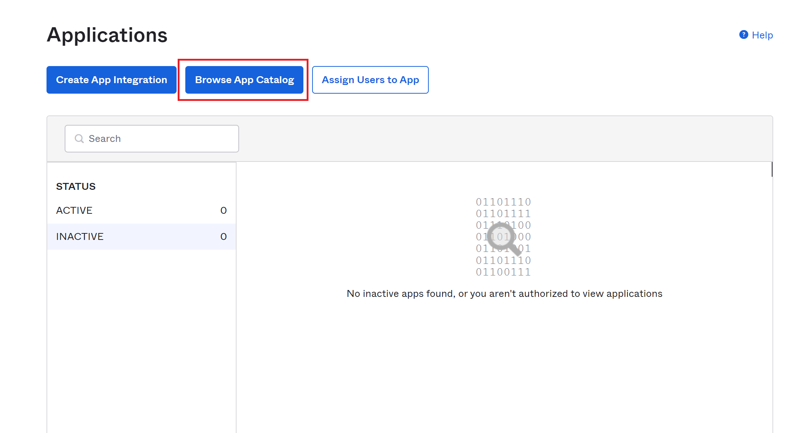
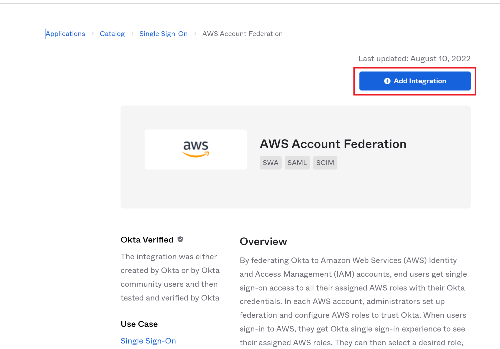
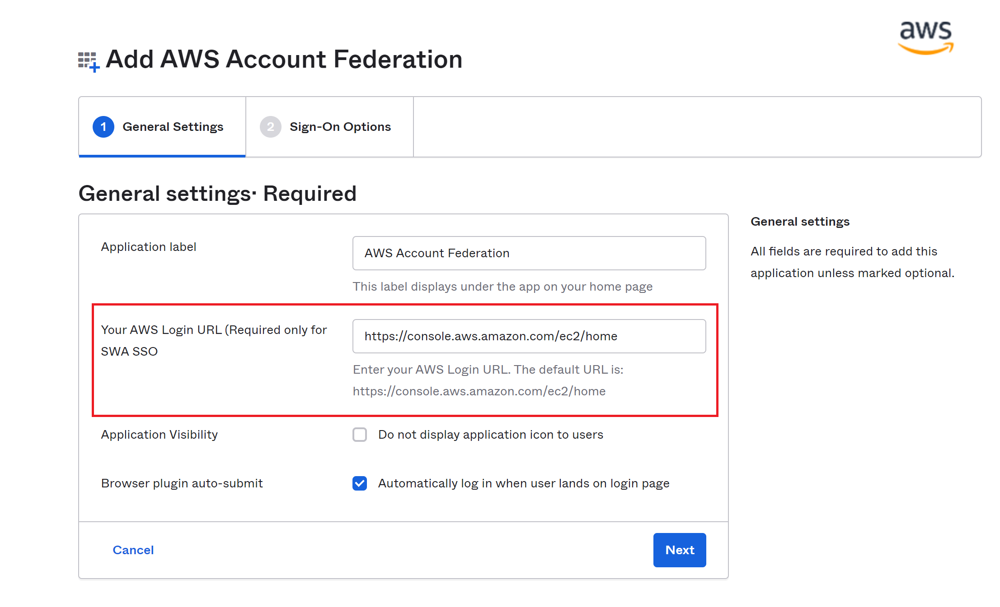
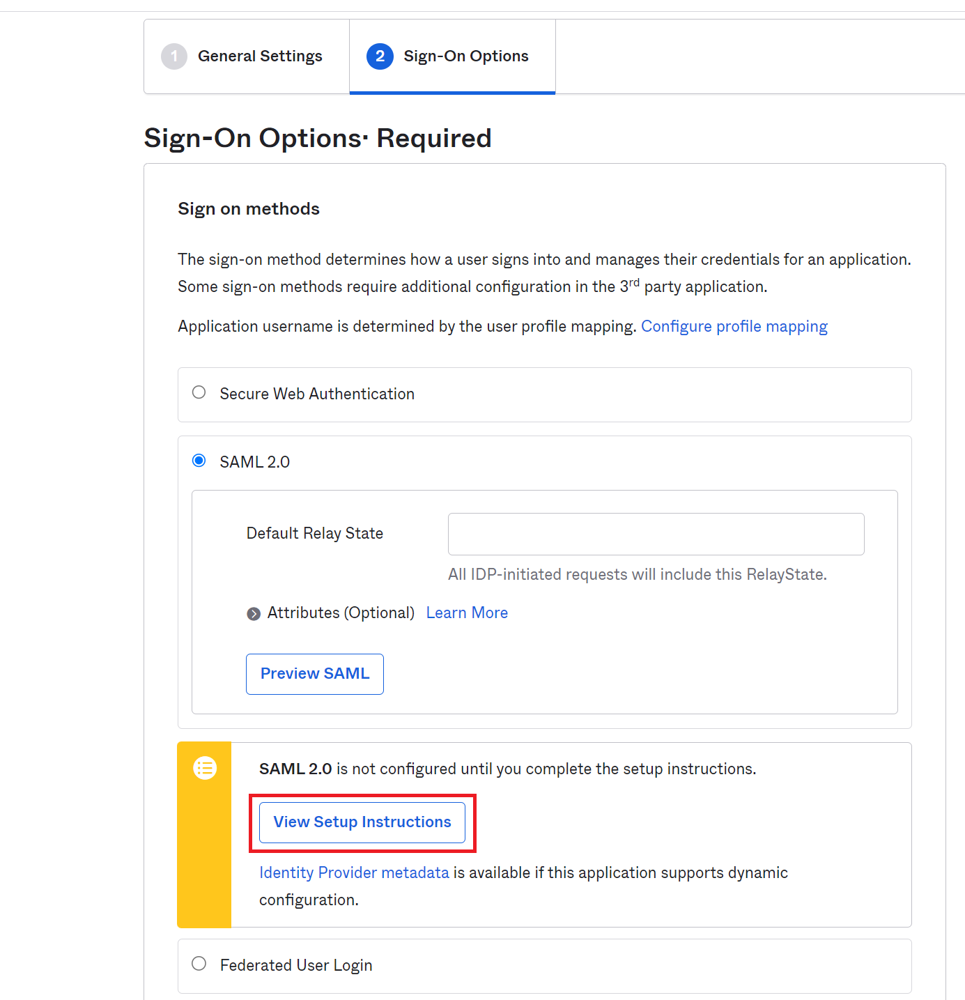
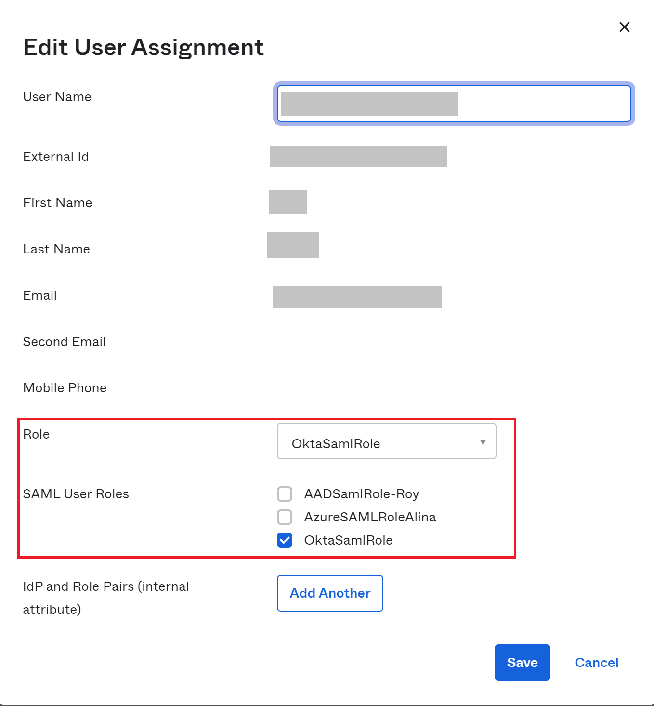
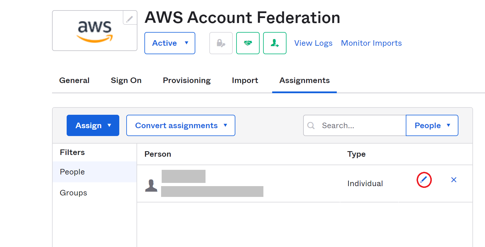
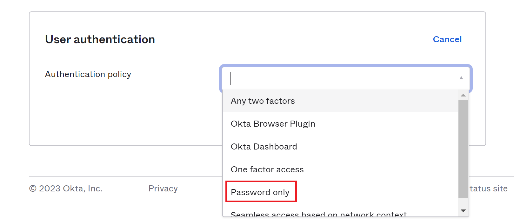

# Okta Authentication Setup Guide

## Prerequisites
1. Admin permissions in AWS to create the identity provider and the roles.
2. An Okta account at Okta (https://www.okta.com)
3. Permission to access to Timestream

## Steps
1. Sign in to the Okta Admin dashboard: `https://<company domain name>-admin.okta.com/admin/apps/active`

2. Select **`Browse App Catalog`** and search for **`AWS Account Federation`**.

3. Open AWS Account Federation and click **`Add Integration`**.

4. Change **`Your AWS Login URL`** to the appropriate URL, e.g. _`https://console.aws.amazon.com/console/home?region=us-west-2`_.

5. Click **`Next`**.
6. Select **`SAML 2.0`** as **`Sign on methods`**. Click **`View Setup Instructions`**, a new window with setup instructions will be popped up.

7. Follow **`CONNECT OKTA TO A SINGLE AWS INSTANCE`** to setup SAML with Okta.

## TroubleShooting
1. Fail to login to AWS by clicking **`AWS Account Federation`**.

    One possible reason is user is not assigned SAML roles. Go to **`Assignments`** tab in application **`AWS Account Federation`**. Click the pencil icon to edit user assignment. Ensure correct role is selected for **`SAML User Roles`**. If no **`Role`** or **`SAML User Roles`** is seen, check **`Provisioning`** tab to ensure **`Create Users`** and **`Update User Attributes`** are enabled.

    

    

2. No **`SAMLResponse`** field in the SAML Assertion response returned from Okta when using Timestream ODBC driver.

    Go to **`Sign On`** tab in application **`AWS Account Federation`**. Scroll down to the bottom. Check **`Authentication policy`** under  section **`User authentication`**. Make sure it is **`Password only`**.

    