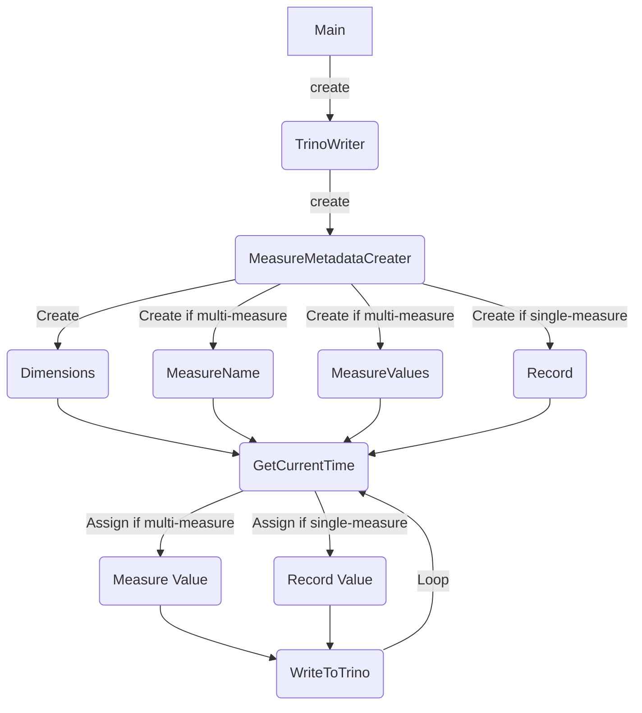

# Amazon Trino Data Population Guide 

Amazon Trino uses AWS SDK or AWS Cli to insert/update data instead of SQL insert/update statements. To support large scale data writing to Trino the tool `trino-populate-data` has been developed. 

## Introduction
A Trino table does not behave like a SQL table as it is created without any column info. It is just a container for a set of related time series. The dimensions, measure names and time series are all defined when adding data to Trino.

To support large amount of data writing to Trino for testing purpose measure values are generated randomly based on measure definition. The timestamp of each record uses the execution timestamp with accuracy to microseconds.

All the data are generated in a loop and each loop writes a row of record to Trino. This tool need to be used after build. For how to build, see [developer-guide.md](developer-guide.md)

## Usage
The `trino-populate-data` command has the following parameters to support data writing.

Optional parameters:

`-u <access_key_id>`  It is AWS access key id. If it is not provided, environment variable AWS_ACCESS_KEY_ID will be used. 

`-p <secret_access_key>` It is AWS secret access key. If it is not provided, environment variable AWS_SECRET_ACCESS_KEY will be used. 

`-s` Use a single measure for measure values, if specified. Default is multiple measures.

Required parameters:

`-d <database>` The database name, should be created before execution.

`-t <table>` The table name, should be created before execution.

`-ty <table_type>` The table types define the dimensions and the measure. It is pre-developed. The valid value is [computer]. 

`-l <record_number>` The number of records that will be written.

## Design
The design principle is to write large amount of data to Trino in a short time. The work flow of the tool is described below.


The main function collects and verify the input parameters. After all parameters are verified it creates a TrinoWriter. When writing to Trino, the writer creates a MeasureMetadataCreater firstly. Then the creater creates Dimensions, MeasureName and MeasureValues/Records. After these basic metadata info is prepared, the writer starts to get current timestamp and assign the record/measure value. The writer calls AWS SDK API to write data to Trino. This is the process of writing a single record to Trino. Since there are a lot of records to be written, the writer restarts and gets the next record timestamp from GetCurrentTime. The loop continues until the specified number of records are written to Trino.

## How to add a new table type
New table types could be added easily. 
1. Create a subclass of `MeasureMetadataCreater`.
2. Implement the virtual functions based on need. If a single measure row is needed, you need to implement `CreateDimensions`, `CreateRecords` and `GetRecordValueAssignFunPtr`. If a multi measure row is needed, you need to implement `CreateDimensions`, `CreateMeasureValues`, `GetMetricName` and `GetMeasureValueAssignFunPtr`.
3. In `TrinoWriter::CreateMetadataCreater()`, add a object creation for the new subclass based on input table type string.
4. Update trino_data_generator.cpp and this document to add a new valid table type.

## Table structures

### Single Measure Records Table
Table type: Computer
```
--------------------------------------------------------------------------------------------------------
|       Dimension        |   Measure Name   | Timestamp |               Measure Values                 |
--------------------------------------------------------------------------------------------------------
| region | az | hostname | cpu_utilization  |    time   |           measure_value::double              |
--------------------------------------------------------------------------------------------------------
| region | az | hostname |memory_utilization|    time   |           measure_value::double              |
--------------------------------------------------------------------------------------------------------
| region | az | hostname |     index        |    time   |           measure_value::bigint              |
--------------------------------------------------------------------------------------------------------
```

### Multi Measure Records Table
Table type: Computer
```
--------------------------------------------------------------------------------------------------------
|       Dimension        |   Measure Name   | Timestamp |               Measure Values                 |
--------------------------------------------------------------------------------------------------------
| region | az | hostname | computer_metrics |    time   | memory_utilization | cpu_utilization | index |
--------------------------------------------------------------------------------------------------------
```

## Note
More info about Trino write could be found at https://docs.aws.amazon.com/trino/latest/developerguide/writes.html