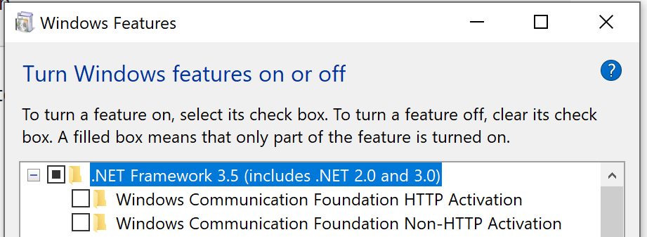
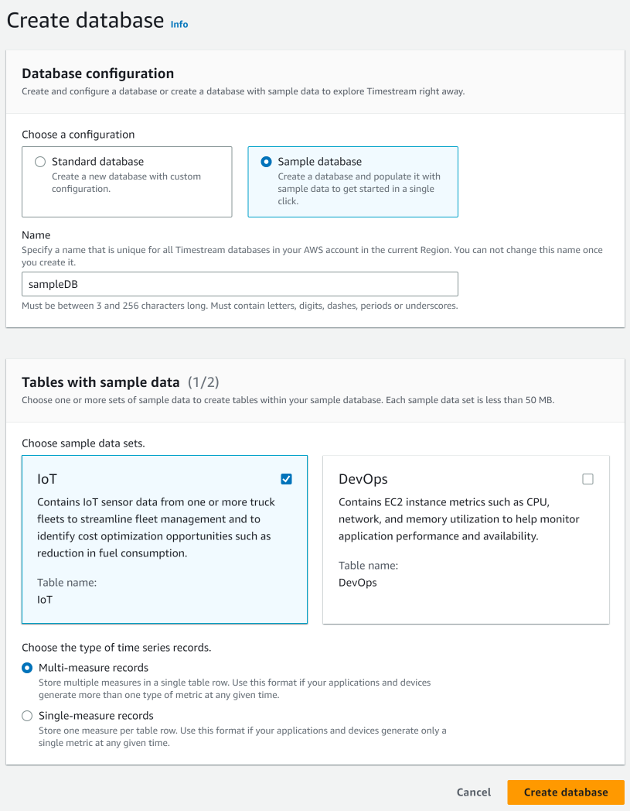

# Development Environment

For documentation regarding Power BI connector, please refer to [build Power BI connector](./powerbi-connector-setup/build_powerbi_connector.md).

## Pre-requisites

### C/C++ Formatting

- This project uses [Google's C++ Style Guide](https://google.github.io/styleguide/cppguide.html) as a basis for
C/C++ usage and formatting.
- Some formatting is set using the .clang-format file at the base of repository. Other options for Visual Studio can be imported from the
`VS-C++-Settings-Export.vssettings` file also found at root of repository.

### Environment Variables for Testing Accounts/Secrets
- To use IAM accessKeyId and secretKey to access AWS Timestream, you need to specify the following environment variables.

   | Enviornment Variable | Description |
   |----------------------|-------------|
   | AWS_ACCESS_KEY_ID | `<AWS Access Key ID>` |
   | AWS_SECRET_ACCESS_KEY | `<AWS Secret Access Key>` |
   | AWS_SESSION_TOKEN | `<Session Token>`, if your account is enabled with MFA

- [ Optional ] Log configurations

  Set these 2 variables only if you would like to set a custom log path or log level for connection tests; it is completely optional.
    1. `TIMESTREAM_LOG_PATH`=`<path_to_log_file>`(e.g.:`"C:\\Users\\BitQuillUser\\Desktop\\Timestream ODBC Driver"`)

    The user needs to ensure that the directory mentioned in the log file path exists or the driver will ignore the user's passed-in value and create the log file in the default log path. Do **not** include a slash at the end of the log path.

    The log path indicates the path to store the log file. The log file name is formatted as `timestream_odbc_YYYYMMDD.log`, where `YYYYMMDD` (e.g., 20220225 <= Feb 25th, 2022) is the date at the first log message.

    2. `TIMESTREAM_LOG_LEVEL`=`<log_level>`. The default is `2` (means WARNING Level). Possible values:
         - 0: OFF
         - 1: ERROR
         - 2: WARNING
         - 3: INFO
         - 4: DEBUG

    More details about logging in [`support\troubleshooting-guide.md`](../support/troubleshooting-guide.md).

- AWS Logs

  This ODBC driver uses AWS logs beside its own logging. Please see how AWS Logs work in their [official document](https://docs.aws.amazon.com/sdk-for-cpp/v1/developer-guide/logging.html). The logs will be stored inthe executable directory following the default naming pattern of `aws_sdk_<date>.log`.

### Test Data
Test data are needed for tests to run successfully and they only need to be loaded once for each AWS account. Check [here](#data-population-for-testing) for instructions on loading the test data.

## Windows

1. Microsoft Visual Studio (Community 2019 Verified)
   1. Desktop Development for C++
   2. Visual Studio core editor
   3. C++ ATL for latest v142 build tools (x86 & x64)
   4. C++ MFC for latest v142 build tools (x86 & x64)
   5. [WiX Toolset v3 Schemas for Visual Studio](https://wixtoolset.org/docs/wix3/)
      If encountering "wix toolset requires .net 3.5.1 to be enabled", follow the steps below.
      1. Open Settings -> Apps -> Optional Features -> Under "Related Settings", click on "More Windows features", and select ".Net Framework 3.5".
      
   6. [WiX Toolset Visual Studio 2019 Extension](https://marketplace.visualstudio.com/items?itemName=WixToolset.WiXToolset)
2. [WiX Installer (3.11)](https://wixtoolset.org/releases/)
   1. Ensure to add path to WiX executables (e.g. `C:\Program Files (x86)\WiX Toolset v3.11\bin`)
3. Boost Test Framework
   1. Install [VCPKG](https://vcpkg.io/en/getting-started.html)
   2. `cd vcpkg`
   3. Install Boost and AWS SDK

      `.\vcpkg install boost-test:x64-windows boost-asio:x64-windows boost-chrono:x64-windows boost-interprocess:x64-windows boost-regex:x64-windows boost-system:x64-windows boost-thread:x64-windows --recurse`
5. Run `.\vcpkg integrate install` to implicitly add Include Directories, Link Directories, and Link Libraries for all packages installed with Vcpkg to all VS2015, VS2017 and VS2019 MSBuild projects
6. On the Developer PowerShell, run one of the build scripts to create an initial compilation.
   1. E.g.: `.\build_win_debug64.ps1`
   2. Navigate to the `build\odbc\cmake` folder to use the generated solution file, `Timestream-ODBC.sln` to work on
   source code development and testing.
8. Open a **64-bit** command shell or **64-bit** PowerShell window, **as Administrator**, run the command below
   ```
   .\<repo-folder>\src\odbc\install\install_amd64.cmd <repo-folder>\build\odbc\cmake\Debug\timestream.odbc.dll
   ```
   Ensure that backslashes are used in your command.
9. Now you're ready to begin [configuration for integration and unit testing](#integration-tests).
10. Once configured, run the tests:
    - Run integration tests: `.\build\odbc\bin\<Release or Debug>\timestream-odbc-integration-tests.exe`.
    - Run unit tests: `.\build\odbc\bin\<Release or Debug>\timestream-odbc-unit-tests.exe`.

### Known issues
Driver installer detects existing driver and isn't allowing installation
   1. Go to `Apps & Features` settings page and search for `Timestream ODBC Driver`. If there is already a Timestream ODBC driver installed, manually uninstall the driver (optional to uninstall C++ Redistributable, for details see [Windows installation guide](windows-installation-guide#microsoft-visual-c-redistributable)), and then attempt installing again. 
   2. If the driver is not showing under `Apps & Features`, remove driver registry `Computer\HKEY_LOCAL_MACHINE\SOFTWARE\ODBC\ODBCINST.INI\Amazon Timestream ODBC Driver` using [Registry Editor](https://support.microsoft.com/en-us/windows/how-to-open-registry-editor-in-windows-10-deab38e6-91d6-e0aa-4b7c-8878d9e07b11), and then attempt installing again.

   - If you wish to re-register the driver, follow step 6 under [Windows developer setup guide](#windows)

## MacOS

1. Install dependencies
   1. `brew install cmake`
   2. `brew install libiodbc`  
      - You may need to unlink `unixodbc` if you already have this installed. Use `brew unlink unixodbc`.
      - You may need to run `brew link --overwrite --force libiodbc`.
   3. `brew install boost`
   4. If creating a debug build (`./build_mac_debug64.sh`), LLVM is required.
      - If you only have XCode Command Line Tools, use the LLVM included with XCode by modifying the PATH with `export PATH=/Library/Developer/CommandLineTools/usr/bin/:$PATH`. Ensure this XCode path comes first in $PATH. If error occurs, check that clang and llvm are under folder Library/Developer/CommandLineTools/usr/bin.
      - If you have XCode application, to ensure LLVM and CMake are compatible, use the LLVM included with XCode by modifying the PATH with `export PATH=/Applications/Xcode.app/Contents/Developer/Toolchains/XcodeDefault.xctoolchain/usr/bin/:$PATH`.
2. Run one of the build scripts to create an initial compilation.
   1. E.g.: from the root of the Timestream ODBC repository, run `./build_mac_release64.sh`
   2. The generated driver files will be placed in the `build/odbc/lib` folder.
3. Set the environment variable `ODBCINSTINI`. On a developer's machine, set it to `<repo-folder>/build/odbc/lib/timestream-odbc-install.ini`.
4. Set the environment variable `DYLD_LIBRARY_PATH`. On a developer's machine, set it to `<repo-folder>/build/odbc/lib:$DYLD_LIBRARY_PATH`.
5. Run the following command to register the ODBC driver.
   `./scripts/register_driver_unix.sh`.
6. Now you're ready to begin [configuration for integration and unit testing](#integration-tests).
7. Once configured, run the tests:
      - Run integration tests: `./build/odbc/bin/timestream-odbc-integration-tests --catch_system_errors=false`.
      - Run unit tests: `./build/odbc/bin/timestream-odbc-unit-tests  --catch_system_errors=false`.

You should have all the following environment variables set. If you encounter any issues, check that these variables
have all been set correctly:
- `AWS_ACCESS_KEY_ID` (from prerequisites)
- `AWS_SECRET_ACCESS_KEY` (from prerequisites)
- `ODBCINSTINI`
- `DYLD_LIBRARY`

## Linux

### Using Ubuntu 64bit

1. Install all dependencies
   1. Ubuntu dev dependencies
      E.g.
```
           apt-get -y update \
           && apt-get -y install wget \
                                 curl \
                                 libcurl4-openssl-dev \
                                 libssl-dev \
                                 uuid-dev \
                                 zlib1g-dev \
                                 libpulse-dev \
                                 gcc \
                                 gcc-multilib  \
                                 g++ \
                                 g++-multilib \
                                 build-essential \
                                 valgrind \
                                 libboost-all-dev \
                                 libsasl2-dev \
                                 lcov \
                                 git \
                                 unixodbc-dev \
                                 valgrind \
                                 zip \
                                 unzip \
                                 tar \
                                 rpm                         
```
   2. Run one of the build scripts to create an initial compilation. E.g. `./build_linux_release64_deb.sh`
   3. Set all necessary environment variables and run the following command to register the ODBC driver. 

      `./scripts/register_driver_unix.sh`
   4. Set environment variables for testing and double-check if all dev environmnet variables are set running `scripts/env_variables_check.sh`.
   5. Now you're ready to begin [configuration for integration and unit testing](#integration-tests).
   6. Once configured, run the tests under the repository root folder:
         - Run integration tests: `./build/odbc/bin/timestream-odbc-integration-tests --catch_system_errors=false`.
         - Run unit tests: `./build/odbc/bin/timestream-odbc-unit-tests --catch_system_errors=false`.

### Using openSUSE 64bit

1. Install all dependencies
   1. openSUSE dev dependencies
      E.g.
```
           zypper refresh \
           && zypper install wget \
                                 curl \
                                 gcc \
                                 gcc-c++ \
                                 valgrind \
                                 lcov \
                                 git \
                                 valgrind \
                                 zip \
                                 unzip \
                                 tar \
                                 rpm    \
                                 libopenssl-3-devel \
                                 openssl \
                                 cmake \
                                 libcurl-devel \
                                 unixODBC \
                                 unixODBC-devel \
                                 rpmbuild \
                                 libboost_regex-devel \
                                 libboost_system-devel \
                                 libboost_thread-devel \
                                 libboost_chrono-devel \
                                 libboost_test-devel \
                                 boost-devel 
        
```
   2. Run one of the build scripts to create an initial compilation. E.g. `./build_linux_release64_deb.sh`
   3. Set all necessary environment variables and run the following command to register the ODBC driver. 

      `sudo ./scripts/register_driver_unix.sh`
   4. Set environment variables for testing and double-check if all dev environmnet variables are set running `scripts/env_variables_check.sh`.
   5. Now you're ready to begin [configuration for integration and unit testing](#integration-tests).
   6. Once configured, run the tests under repository root folder:
         - Run integration tests: `./build/odbc/bin/timestream-odbc-integration-tests --catch_system_errors=false`.
         - Run unit tests: `./build/odbc/bin/timestream-odbc-unit-tests --catch_system_errors=false`.

### Using Ubuntu 32bit

1. Install all dependencies
   1. Ubuntu dev dependencies
      E.g.
```
           apt-get -y update \
           && apt-get -y install wget \
                                 curl \
                                 libcurl4-openssl-dev \
                                 libssl-dev \
                                 uuid-dev \
                                 zlib1g-dev \
                                 libpulse-dev \
                                 gcc \
                                 gcc-multilib  \
                                 g++ \
                                 g++-multilib \
                                 build-essential \
                                 valgrind \
                                 libboost-all-dev \
                                 libsasl2-dev \
                                 lcov \
                                 git \
                                 unixodbc-dev \
                                 valgrind \
                                 zip \
                                 unzip \
                                 tar \
                                 rpm                           
```
   2. Install cmake
   `apt-get install cmake`

   3. The version of cmake installed is lower than 3.20 which is the minimal required version. Follow below steps to build cmake 3.20 (or above) from source. 
    
      1. Download cmake 3.20 or above from https://github.com/Kitware/CMake/releases/

      2. Under cmake source directory create a build directory 
         
         `mkdir build`
    
      3. Run `cmake` under source directory
      4. `cd build` and run `make`
      5. Install the new cmake
         
         `sudo make install`

      6. Add `/usr/local/bin` to PATH and make sure it is ahead of lower version cmake path
         `export PATH=/usr/local/bin:$PATH`
   4. Run one of the build scripts to create an initial compilation. E.g. `./build_linux_release32_deb.sh`
   5. Set all necessary environment variables and run the following command to register the ODBC driver. 

      `./scripts/register_driver_unix.sh`
   6. Set environment variables for testing and double-check if all dev environmnet variables are set running `scripts/env_variables_check.sh`.
   7. Now you're ready to begin [configuration for integration and unit testing](#integration-tests).
   8. Once configured, run the tests under repository root folder:
         - Run integration tests: `./build/odbc/bin/timestream-odbc-integration-tests --catch_system_errors=false`.
         - Run unit tests: `./build/odbc/bin/timestream-odbc-unit-tests --catch_system_errors=false`.

### Known issues

When running integration tests you may encounter the error
```
message: 01000: [unixODBC][Driver Manager]Can't open lib 'Amazon Timestream ODBC Driver' : file not found
```
Running `./scripts/register_driver_unix.sh` and copying `/etc/odbcinst.ini` to `$HOME/.odbcinist.ini` and `/etc/odbc.ini` to `$HOME/.odbc.ini` may help the Driver and DNS be discovered.

## Code Coverage

### MacOS/Linux
To generate code coverage reports you to need to use the debug builds for macOS/Linux, run the tests and use `gcovr` to compile the report. For an installation guide and how to use it look at the official (documentation)[https://gcovr.com/en/stable/index.html].
If you want to check a detailed report generate the with `--html-details` option.

### Windows
OpenCppCoverage is used to generate code coverage for windows, for more information check it in the official (documentation)[https://github.com/OpenCppCoverage/OpenCppCoverage]

## Versioning
1. To set the version of the ODBC driver, update the `src/ODBC_DRIVER_VERSION.txt` file with the appropriate version.

## Database Reporting
By default, the Timestream ODBC driver reports databases as catalogs. This behavior is matching with Timestream ODBC Driver version 1.0.0, and it is due to Excel on macOS not showing tables with duplicate names when databases are reported as schemas.
Driver will report databases as schemas when the user exports environment variable `DATABASE_AS_SCHEMA` to `TRUE`.
|   Value of `DATABASE_AS_SCHEMA`  | Behavior of driver                                                           |
|----------------------------------|------------------------------------------------------------------------------|
| `TRUE`                           | Databases are reported as schemas. Catalogs will not be supported by driver. |
| any other value/unset            | Databases are reported as catalogs. Schemas will not be supported by driver. |


## Data Population for Testing
For the tests to run successfully, test data needs to be loaded. **Note that all test data must be loaded in region `us-west-2`.**

1. Follow below instructions to load sample data from Timestream.
   
   i. To load `SampleDB.IoTMulti`: Go to **Timestream** → **Databases**. Click `Create database` and you’ll see the below page. Select `Sample database` and enter `SampleDB` as database name. Check `IoT` and select `Multi-measure records`. Finished page should look like below.

   
   
   Then clicking on "Create Database" will create the desired database.

   ii. To load `meta_queries_test_db.IoTMulti` and `meta_queries_test_db.DevOpsMulti`: Go to **Timestream** → **Databases**. Click `Create database` and you’ll see the below page. Select `Sample database` and enter `meta_queries_test_db` as database name. Check `IoT` and `DevOps` and select `Multi-measure records`. 

   
    
   Then clicking on "Create Database" will create the desired database.

2. Run below commands to load the test data. The commands provided work on Linux and Windows Command Prompt, please modify the command to work with your desired platform. For help around using quotation marks in different platforms, please visit [AWS official guide for using quotation marks](https://docs.aws.amazon.com/cli/latest/userguide/cli-usage-parameters-quoting-strings.html). For general help with AWS CLI commands, please visit [Amazon Timestream official CLI guide](https://docs.aws.amazon.com/timestream/latest/developerguide/Tools.CLI.html) and [AWS CLI general guide](https://docs.aws.amazon.com/cli/latest/userguide/cli-chap-using.html).

```
# Run following AWS CLI command to create table meta_queries_test_db.TestColumnsMetadata1 and enable magnetic storage writes
aws timestream-write create-table --database-name meta_queries_test_db  --table-name TestColumnsMetadata1 --magnetic-store-write-properties "{\"EnableMagneticStoreWrites\": true}"

# Run the following AWS CLI command to fill data for meta_queries_test_db.TestColumnsMetadata1 
aws timestream-write write-records --database-name meta_queries_test_db  --table-name TestColumnsMetadata1 --common-attributes "{\"Dimensions\":[{\"Name\":\"device_id\",  \"Value\":\"00000001\"}, {\"Name\":\"地区\", \"Value\":\"us-west-1\"} ], \"Time\":\"1666292462000\",\"TimeUnit\":\"MILLISECONDS\"}" --records "[{\"MeasureName\":\"video_metrics\", \"MeasureValueType\":\"MULTI\", \"MeasureValues\": [{\"Name\":\"video_startup_time\",\"Value\":\"1\",\"Type\":\"BIGINT\"}, {\"Name\":\"rebuffering_ratio\",\"Value\":\"0.1\",\"Type\":\"DOUBLE\"}, {\"Name\":\"flag\",\"Value\":\"true\",\"Type\":\"BOOLEAN\"}]}]"

# Run following AWS CLI command to disable magnetic storage writes for table meta_queries_test_db.TestColumnsMetadata1
aws timestream-write update-table --database-name meta_queries_test_db  --table-name TestColumnsMetadata1 --magnetic-store-write-properties "{\"EnableMagneticStoreWrites\": false}"


# Run following AWS CLI command to create table meta_queries_test_db.TestColumnsMetadata2 and enable magnetic storage writes
aws timestream-write create-table --database-name meta_queries_test_db  --table-name TestColumnsMetadata2 --magnetic-store-write-properties "{\"EnableMagneticStoreWrites\": true}"

# Run the following AWS CLI command to fill data for meta_queries_test_db.TestColumnsMetadata2
aws timestream-write write-records --database-name meta_queries_test_db  --table-name TestColumnsMetadata2 --common-attributes "{\"Dimensions\":[{\"Name\":\"device_id\",  \"Value\":\"00000001\"}, {\"Name\":\"地区\", \"Value\":\"us-west-1\"} ], \"Time\":\"1666292462000\",\"TimeUnit\":\"MILLISECONDS\"}" --records "[{\"MeasureName\":\"video_metrics\", \"MeasureValueType\":\"MULTI\", \"MeasureValues\": [{\"Name\":\"video_startup_time\",\"Value\":\"1\",\"Type\":\"BIGINT\"}, {\"Name\":\"rebuffering_ratio\",\"Value\":\"0.1\",\"Type\":\"DOUBLE\"}, {\"Name\":\"flag\",\"Value\":\"true\",\"Type\":\"BOOLEAN\"}]}]"

# Run following AWS CLI command to disable magnetic storage writes for table meta_queries_test_db.TestColumnsMetadata2
aws timestream-write update-table --database-name meta_queries_test_db  --table-name TestColumnsMetadata2 --magnetic-store-write-properties "{\"EnableMagneticStoreWrites\": false}"

# Run below command to create database data_queries_test_db
aws timestream-write create-database --database-name data_queries_test_db

# Run below command to create table meta_queries_test_db.testTableMeta. It is kept as empty table
aws timestream-write create-table --database-name meta_queries_test_db --table-name  testTableMeta

# Run below command to create table data_queries_test_db.TestScalarTypes and enable magnetic storage writes
aws timestream-write create-table --database-name data_queries_test_db --table-name TestScalarTypes --magnetic-store-write-properties "{\"EnableMagneticStoreWrites\": true}"

# Run the following AWS CLI commands to fill data for meta_queries_test_db.TestScalarTypes
aws timestream-write write-records --database-name data_queries_test_db  --table-name TestScalarTypes --common-attributes "{\"Dimensions\":[{\"Name\":\"device_id\",  \"Value\":\"00000001\"}, {\"Name\":\"device_type\", \"Value\":\"iPhone1\"}, {\"Name\":\"os_version\", \"Value\":\"1.0\"}, {\"Name\":\"region\", \"Value\":\"us-west-1\"} ], \"Time\":\"1666292462000\",\"TimeUnit\":\"MILLISECONDS\"}" --records "[{\"MeasureName\":\"video_metrics\", \"MeasureValueType\":\"MULTI\", \"MeasureValues\": [{\"Name\":\"video_startup_time\",\"Value\":\"1\",\"Type\":\"BIGINT\"}, {\"Name\":\"rebuffering_ratio\",\"Value\":\"0.1\",\"Type\":\"DOUBLE\"}, {\"Name\":\"flag\",\"Value\":\"TRUE\",\"Type\":\"BOOLEAN\"}]}]"

aws timestream-write write-records --database-name data_queries_test_db  --table-name TestScalarTypes --common-attributes "{\"Dimensions\":[{\"Name\":\"device_id\",  \"Value\":\"00000002\"}, {\"Name\":\"device_type\", \"Value\":\"iPhone2\"}, {\"Name\":\"os_version\", \"Value\":\"2.0\"}, {\"Name\":\"region\", \"Value\":\"us-west-2\"} ], \"Time\":\"1666378862000\",\"TimeUnit\":\"MILLISECONDS\"}" --records "[{\"MeasureName\":\"video_metrics\", \"MeasureValueType\":\"MULTI\", \"MeasureValues\": [{\"Name\":\"video_startup_time\",\"Value\":\"2\",\"Type\":\"BIGINT\"}, {\"Name\":\"rebuffering_ratio\",\"Value\":\"0.2\",\"Type\":\"DOUBLE\"}, {\"Name\":\"flag\",\"Value\":\"false\",\"Type\":\"BOOLEAN\"}]}]"

aws timestream-write write-records --database-name data_queries_test_db  --table-name TestScalarTypes --common-attributes "{\"Dimensions\":[{\"Name\":\"device_id\",  \"Value\":\"00000003\"}, {\"Name\":\"device_type\", \"Value\":\"iPhone3\"}, {\"Name\":\"os_version\", \"Value\":\"3.0\"}, {\"Name\":\"region\", \"Value\":\"us-west-3\"} ], \"Time\":\"1666465262000\",\"TimeUnit\":\"MILLISECONDS\"}" --records "[{\"MeasureName\":\"video_metrics\", \"MeasureValueType\":\"MULTI\", \"MeasureValues\": [{\"Name\":\"video_startup_time\",\"Value\":\"3\",\"Type\":\"BIGINT\"}, {\"Name\":\"rebuffering_ratio\",\"Value\":\"0.3\",\"Type\":\"DOUBLE\"}, {\"Name\":\"flag\",\"Value\":\"TRUE\",\"Type\":\"BOOLEAN\"}]}]"

aws timestream-write write-records --database-name data_queries_test_db  --table-name TestScalarTypes --common-attributes "{\"Dimensions\":[{\"Name\":\"device_id\",  \"Value\":\"00000004\"}, {\"Name\":\"device_type\", \"Value\":\"iPhone4\"}, {\"Name\":\"os_version\", \"Value\":\"4.0\"}, {\"Name\":\"region\", \"Value\":\"us-west-4\"} ], \"Time\":\"1666551662000\",\"TimeUnit\":\"MILLISECONDS\"}" --records "[{\"MeasureName\":\"video_metrics\", \"MeasureValueType\":\"MULTI\", \"MeasureValues\": [{\"Name\":\"video_startup_time\",\"Value\":\"4\",\"Type\":\"BIGINT\"}, {\"Name\":\"rebuffering_ratio\",\"Value\":\"0.4\",\"Type\":\"DOUBLE\"}, {\"Name\":\"flag\",\"Value\":\"False\",\"Type\":\"BOOLEAN\"}]}]"

aws timestream-write write-records --database-name data_queries_test_db  --table-name TestScalarTypes --common-attributes "{\"Dimensions\":[{\"Name\":\"device_id\",  \"Value\":\"00000005\"}, {\"Name\":\"device_type\", \"Value\":\"iPhone13\"}, {\"Name\":\"os_version\", \"Value\":\"13.0\"}, {\"Name\":\"region\", \"Value\":\"us-west-5\"} ], \"Time\":\"1666551663000\",\"TimeUnit\":\"MILLISECONDS\"}" --records "[{\"MeasureName\":\"performance\", \"MeasureValueType\":\"MULTI\", \"MeasureValues\": [{\"Name\":\"cpu_usage\",\"Value\":\"63.7\",\"Type\":\"DOUBLE\"}]}]"

aws timestream-write write-records --database-name data_queries_test_db  --table-name TestScalarTypes --common-attributes "{\"Dimensions\":[{\"Name\":\"device_id\",  \"Value\":\"00000006\"}, {\"Name\":\"device_type\", \"Value\":\"iPhone13\"}, {\"Name\":\"os_version\", \"Value\":\"13.0\"}, {\"Name\":\"region\", \"Value\":\"美西-5\"} ], \"Time\":\"1666551664000\",\"TimeUnit\":\"MILLISECONDS\"}" --records "[{\"MeasureName\":\"performance\", \"MeasureValueType\":\"MULTI\", \"MeasureValues\": [{\"Name\":\"cpu_usage\",\"Value\":\"89.6\",\"Type\":\"DOUBLE\"}]}]"

# Run following AWS CLI command to disable magnetic storage writes for table data_queries_test_db.TestScalarTypes
aws timestream-write update-table --database-name data_queries_test_db --table-name TestScalarTypes --magnetic-store-write-properties "{\"EnableMagneticStoreWrites\": false}"

# Run below command to create table data_queries_test_db.TestComplexTypes and enable magnetic storage writes
aws timestream-write create-table --database-name data_queries_test_db --table-name  TestComplexTypes --magnetic-store-write-properties "{\"EnableMagneticStoreWrites\": true}"

# Run the following AWS CLI commands to fill data for data_queries_test_db.TestComplexTypes
aws timestream-write write-records --database-name data_queries_test_db --table-name TestComplexTypes --common-attributes "{\"Dimensions\":[{\"Name\":\"region\", \"Value\":\"us-east-1\"}, {\"Name\":\"az\", \"Value\":\"us-east-1d\"}, {\"Name\":\"vpc\", \"Value\":\"vpc-1a2b3c4d\"}, {\"Name\":\"instance_id\", \"Value\":\"i-1234567890abcdef0\"}], \"Time\":\"1575486000000\",\"TimeUnit\":\"MILLISECONDS\"}" --records "[{\"MeasureName\":\"cpu_utilization\", \"MeasureValueType\":\"DOUBLE\",\"MeasureValue\":\"35.2\"}]"

aws timestream-write write-records --database-name data_queries_test_db --table-name TestComplexTypes --common-attributes "{\"Dimensions\":[{\"Name\":\"region\", \"Value\":\"us-east-1\"}, {\"Name\":\"az\", \"Value\":\"us-east-1d\"}, {\"Name\":\"vpc\", \"Value\":\"vpc-1a2b3c4d\"}, {\"Name\":\"instance_id\", \"Value\":\"i-1234567890abcdef0\"}], \"Time\":\"1575486060000\",\"TimeUnit\":\"MILLISECONDS\"}" --records "[{\"MeasureName\":\"cpu_utilization\", \"MeasureValueType\":\"DOUBLE\",\"MeasureValue\":\"38.2\"}]"

aws timestream-write write-records --database-name data_queries_test_db --table-name TestComplexTypes --common-attributes "{\"Dimensions\":[{\"Name\":\"region\", \"Value\":\"us-east-1\"}, {\"Name\":\"az\", \"Value\":\"us-east-1d\"}, {\"Name\":\"vpc\", \"Value\":\"vpc-1a2b3c4d\"}, {\"Name\":\"instance_id\", \"Value\":\"i-1234567890abcdef0\"}], \"Time\":\"1575486120000\",\"TimeUnit\":\"MILLISECONDS\"}" --records "[{\"MeasureName\":\"cpu_utilization\", \"MeasureValueType\":\"DOUBLE\",\"MeasureValue\":\"45.3\"}]"

aws timestream-write write-records --database-name data_queries_test_db --table-name TestComplexTypes --common-attributes "{\"Dimensions\":[{\"Name\":\"region\", \"Value\":\"us-east-1\"}, {\"Name\":\"az\", \"Value\":\"us-east-1d\"}, {\"Name\":\"vpc\", \"Value\":\"vpc-1a2b3c4d\"}, {\"Name\":\"instance_id\", \"Value\":\"i-1234567890abcdef1\"}], \"Time\":\"1575486000000\",\"TimeUnit\":\"MILLISECONDS\"}" --records "[{\"MeasureName\":\"cpu_utilization\", \"MeasureValueType\":\"DOUBLE\",\"MeasureValue\":\"54.1\"}]"

aws timestream-write write-records --database-name data_queries_test_db --table-name TestComplexTypes --common-attributes "{\"Dimensions\":[{\"Name\":\"region\", \"Value\":\"us-east-1\"}, {\"Name\":\"az\", \"Value\":\"us-east-1d\"}, {\"Name\":\"vpc\", \"Value\":\"vpc-1a2b3c4d\"}, {\"Name\":\"instance_id\", \"Value\":\"i-1234567890abcdef1\"}], \"Time\":\"1575486060000\",\"TimeUnit\":\"MILLISECONDS\"}" --records "[{\"MeasureName\":\"cpu_utilization\", \"MeasureValueType\":\"DOUBLE\",\"MeasureValue\":\"42.5\"}]"

aws timestream-write write-records --database-name data_queries_test_db --table-name TestComplexTypes --common-attributes "{\"Dimensions\":[{\"Name\":\"region\", \"Value\":\"us-east-1\"}, {\"Name\":\"az\", \"Value\":\"us-east-1d\"}, {\"Name\":\"vpc\", \"Value\":\"vpc-1a2b3c4d\"}, {\"Name\":\"instance_id\", \"Value\":\"i-1234567890abcdef1\"}], \"Time\":\"1575486120000\",\"TimeUnit\":\"MILLISECONDS\"}" --records "[{\"MeasureName\":\"cpu_utilization\", \"MeasureValueType\":\"DOUBLE\",\"MeasureValue\":\"33.7\"}]"

# Run following AWS CLI command to disable magnetic storage writes for table data_queries_test_db.TestComplexTypes
aws timestream-write update-table --database-name data_queries_test_db --table-name TestComplexTypes --magnetic-store-write-properties "{\"EnableMagneticStoreWrites\": false}"

# Run below command to create table data_queries_test_db.EmptyTable. It is kept as empty table
aws timestream-write create-table --database-name data_queries_test_db --table-name EmptyTable
```

3. Load large scale data with data writer.

   i. Run the driver build script, it will build the data writer executable.

   ii. Run below AWS CLI command to create table data_queries_test_db.TestMultiMeasureBigTable and enable magnetic storage writes.
   ```
   aws timestream-write create-table --database-name data_queries_test_db --table-name  TestMultiMeasureBigTable --magnetic-store-write-properties "{\"EnableMagneticStoreWrites\": true}"
   ```

   iii. Run below `timestream-populate-data` command to insert test data for big table tests. For help with this command, see [data-population guide](data-population-guide.md). Note that this command will write data in region `us-west-2`, which is expected by our tests.
   ```
   timestream-populate-data -u <access_key_id> -p <secret_access_key> -d data_queries_test_db -t TestMultiMeasureBigTable -ty computer -l 20000
   ```
   Since this command inserts randomly generated 20000 rows of data, it is estimated to take 15 - 20 minutes for the command to run.

4. (Optional) Now all test data has been loaded. Double check that all table dependencies have been created:
   ```
   sampleDB
   └-- IoTMulti
   meta_queries_test_db
   └-- IoTMulti
   └-- DevOpsMulti
   └-- TestColumnsMetadata1
   └-- TestColumnsMetadata2
   └-- testTableMeta (empty table)
   data_queries_test_db
   └-- TestComplexTypes
   └-- TestScalarTypes
   └-- EmptyTable (empty table)
   └-- TestMultiMeasureBigTable
   ```

### Known Issues with test data loading
#### AWS CLI parsing errors on PowerShell
AWS CLI commands may have parsing errors with PowerShell. The workaround is to wrap the json inputs with single quotes. 
For example, before wrapping json data: `aws timestream-write write-records --database-name <database name>  --table-name <table name> --common-attributes "{<json data>}" --records "{<json data>}"`

After wrapping json data: `aws timestream-write write-records --database-name <database name>  --table-name <table name> --common-attributes '"{<json data>}"' --records '"{<json data>}"'`

#### Lacking permissions to read/change/write table
Reading and writing data on Timestream requires corresponding permissions. For read permissions, it is suggested to add Amazon-managed policy `AmazonTimestreamReadOnlyAccess`. For write permissions, see below for example policy.
```
{
    "Version": "2012-10-17",
    "Statement": [
        {
            "Sid": "VisualEditor0",
            "Effect": "Allow",
            "Action": [
                "timestream:WriteRecords",
                "timestream:CreateDatabase",
                "timestream:UpdateTable",
                "timestream:CreateTable"
            ],
            "Resource": "*"
        }
    ]
}
```

#### `timestream-populate-data` command not found on PowerShell
`timestream-populate-data` is a data population tool provided together with Timestream ODBC driver. It is under `<your_timestream_repository>\build\odbc\bin\<Debug or Release>`, add that path to your environment variable PATH to use it without path.

## Integration Tests

### IAM Profile Tests
1. The IAM profile tests are disabled by default because they require valid IAM profiles. They can be enabled by exporting environment variable `ENABLE_PROFILE_TEST` to `true`. Follow below instructions for setting up valid IAM profiles and required environmenr variables. 
#### Windows
1. `cd` to repository root. Set environment variable REPOSITORY_ROOT to your repository root.
2. Run `.\src\tests\input\create_credentials_file.ps1` to create credential files for testing. Note that this script will write AWS IAM credentials file `src\tests\input\credentials`.
3. Set environment variable AWS_SHARED_CREDENTIALS_FILE to the newly created credentials file.

#### Linux or macOS
1. `cd` to repository root. Set environment variable REPOSITORY_ROOT to your repository root

    `export REPOSITORY_ROOT=<your repository root>`
2. Run `./src/tests/input/create_credentials_file.sh` from the respository root to create credential files for testing. Note that this script will write AWS IAM credentials file `src/tests/input/credentials`.
3. Set environment variable AWS_SHARED_CREDENTIALS_FILE to the newly created credentials file.

    `export AWS_SHARED_CREDENTIALS_FILE=$REPOSITORY_ROOT/src/tests/input/credentials`

### Azure AD Authentication Tests

1. The Azure AD authentication tests are disabled by default because they require valid Azure AD test account. They can be enabled by exporting environment variable `ENABLE_AAD_TEST` to `true`.

2. For AAD integration tests to be run successfully, you need to specify the following environment variables. For instructions on how to set-up and find the AAD connection property values, go to the [SAML 2.0 Azure AD set up guide](/docs/markdown/setup/aad-saml-setup.md#timestream-odbc-dsn-configuration).

   |     Variable Name    | Corresponding Connection String Option |
   |----------------------|----------------------------------------|
   | `AAD_APP_ID`         | AADApplicationID                       |
   | `AAD_ROLE_ARN`       | RoleARN                                |
   | `AAD_IDP_ARN`        | IdPARN                                 |
   | `AAD_TENANT`         | AADTenant                              |
   | `AAD_USER`           | UID or IdPUserName                     |
   | `AAD_USER_PWD`       | PWD or IdPPassword                     |
   | `AAD_CLIENT_SECRET`  | AADClientSecret                        |

### Okta Authentication Tests
1. The Okta authentication tests are disabled by default because they require a valid Okta test account. They can be enabled by exporting environment variable `ENABLE_OKTA_TEST` to `true`.

2. To run Okta authentication test, the environment variables in the following table need to be configured with correct values.  Refer to [Okta Authentication Setup Guide](Okta-setup.md) for instructions on setting up an Okta authentication.

   | Variable Name |  Corresponding Connection String Option   |
   |---------------|-------------------------------------------|
   |`OKTA_HOST`    |   IdPHost                                 |
   |`OKTA_USER`    |   UID or IdPUserName                      |
   |`OKTA_USER_PWD`|   PWD or IdPPassword                      |
   |`OKTA_APP_ID`  |   OktaApplicationID                       |
   |`OKTA_ROLE_ARN`|   RoleARN                                 |
   |`OKTA_IDP_ARN` |   IdPARN                                  |
Ensure `OKTA_HOST` does not include `https://` or `http://`.

### Big Table Pagination Tests
Big table pagination tests are time-consuming. To save time for integration test， they are disabled by default. They could be enabled by export environment variable `BIG_TABLE_PAGINATION_TEST_ENABLE` to `true`.

### Proxy Manual Test on Windows
For setting up connection proxy properties, see [connection proxy guide.](connection-proxy-guide.md).
1. Download proxy-test-server from https://github.com/andris9/proxy-test-server
   `git clone git@github.com:andris9/proxy-test-server.git`
2. Install proxy-test-server
   `npm install proxy-test-server`
3. Run proxy server at port 9999
   `cd proxy-test-server/examples`
   `node proxy.js`
4. Set environment variable TS_PROXY_HOST, TS_PROXY_PORT and TS_PROXY_SCHEME.
5. Start DSN window and create a connection to Timestream. Click 'Test' button to verify.

## Test Results
Unit test results can be viewed in `odbc_unit_test_result.xml` and integration test results can be viewed in `odbc_test_result.xml`.
