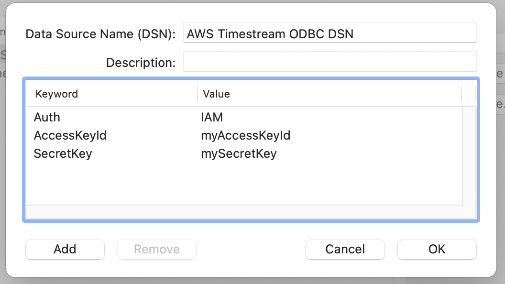
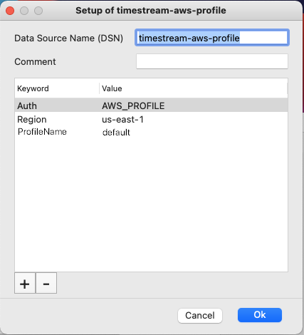

# MacOS - Configuring a DSN

## Prerequisites
In order to use the Timestream ODBC Driver, [ODBC Manager](http://www.odbcmanager.net/) or [iODBC Driver Manager](http://www.iodbc.org/dataspace/doc/iodbc/wiki/iodbcWiki/Downloads) must be installed.

### Using ODBC Manager ###
If ODBC Manager does not have an Amazon Timestream ODBC Driver entry, you can add it following the steps below.

1. Open ODBC Manager.
2. Go to the **Drivers** tab.
3. Click **Add...**.
    * **Driver Name**: The driver name used for ODBC connections (ex. `Amazon Timestream ODBC Driver`)
    * **Driver File**: The path to the driver file (default installed path: `/Library/ODBC/timestream-odbc/lib/libtimestream-odbc.dylib`)
    * **Setup File**: The path to the driver file (default installed path: `/Library/ODBC/timestream-odbc/lib/libtimestream-odbc.dylib`)
    * Set as a **User** or **System** driver
4. Click **OK** to save the options.

### Using iODBC Administrator ###
If iODBC Administrator does not have an Amazon Timestream ODBC Driver entry, you can add it following the steps below.

To give the application permission to save the Driver & DSN configurations, run the following from Terminal.

`sudo /Applications/iODBC/iODBC\ Administrator64.app/Contents/MacOS/iODBC\ Administrator64`

1. Go to the **ODBC Drivers** tab.
2. Click **Add a driver**.
    * **Description of the Driver**: The driver name used for ODBC connections (ex. `Amazon Timestream ODBC Driver`)
    * **Driver File Name**: The path to the driver file (default installed path: `/Library/ODBC/timestream-odbc/lib/libtimestream-odbc.dylib`)
    * **Setup File Name**: The path to the driver file (default installed path: `/Library/ODBC/timestream-odbc/lib/libtimestream-odbc.dylib`)
    * Set as a **System** driver
3. Click **OK** to save the options.

### Add a System Driver Entry ###
If /Library/ODBC/odbcinst.ini does not have an Amazon Timestream ODBC Driver entry, you can add it following the steps below.

Use a text editor from Terminal to edit the odbcinst.ini file such as vi.

**To create a System Driver Entry run:**
`sudo vi /Library/ODBC/odbcinst.ini`

**To add the driver entries:**
1. Add `Amazon Timestream ODBC Driver` in the `[ODBC Drivers]` section.
2. Add the `[Amazon Timestream ODBC Driver]` section.

#### Sample odbcinst.ini file
```
[ODBC Drivers]
Amazon Timestream ODBC Driver  = Installed

[Amazon Timestream ODBC Driver]
Driver = /Library/ODBC/timestream-odbc/lib/libtimestream-odbc.dylib
Setup = /Library/ODBC/timestream-odbc/lib/libtimestream-odbc.dylib
```

## Adding a DSN Entry

You can use **ODBC Manager** or **iODBC Administrator** which is installed with the iODBC Driver Manager, or manually edit the `odbcinst.ini` file.

### Using ODBC Manager ###
1. Go to the **User DSN** tab to create an entry that only you can use or to the **System DSN** tab to create an entry for all users.
2. Select **Add** on the right side of the window.
    * Choose the Driver you added above (e.g. Amazon Timestream ODBC Driver).
    * **Data Source Name (DSN)**: The name of the DSN used to store connection options (e.g. `AWS Timestream ODBC DSN`)
    * **Description**: Not required
    * Add key-value pairs by using the **'Add'** button. See the sample [odbc.ini](#odbc_data_source) file below for entries for each authentication type.
3. Click **OK** to save the DSN configuration.



### Using iODBC Administrator ###
To give the application permission to save the Driver & DSN configurations, run the following from Terminal.

`sudo /Applications/iODBC/iODBC\ Administrator64.app/Contents/MacOS/iODBC\ Administrator64`

1. Go to the **Users** tab to create an entry that only you can use or to the **System** tab to create an entry for all users.
2. Select **Add** on the right side of the window.
    * Choose the Driver you added above (e.g. Amazon Timestream ODBC Driver).
    * **Data Source Name (DSN)**: The name of the DSN used to store connection options (e.g. `AWS Timestream ODBC DSN`)
    * **Comment**: Not required
    * Add key-value pairs by using the **'+'** button. See the sample [odbc.ini](#odbc_data_source) file below for entries for each authentication type.
3. Click **OK** to save the DSN configuration.
4. Click **Test** to test the configuration. A pop-up window that asks for the Username and Password will appear.
* Enter the Username and Password if needed
* Click **OK**
* You should get a message that the connection DSN was tested successfully. Click **OK** to close the window.

<figure>
    
    <figcaption>iODBC DSN</figcaption>
</figure>


**Note:** iODBC may crash when entering the key-value pairs if the Value is in **Edit** mode when the **OK** button is pressed. This can be resolved by pressing **return** while in the **Value** field before pressing **OK**

### Manually editing odbc.ini ###
Use a text editor from Terminal to edit the odbc.ini file such as vi. See [Configuration Options](./connection-string.md) for more details on the individual entries.

**To create a System DSN Entry run:**

`sudo vi /Library/ODBC/odbc.ini`

**To create a User DSN Entry run:**

`vi ~/Library/ODBC/odbc.ini`

#### <a name="odbc_data_source"></a>Sample odbc.ini file
```
[ODBC Data Sources]
timestream-iam-profile  = Amazon Timestream ODBC Driver
timestream-aad-profile  = Amazon Timestream ODBC Driver
timestream-okta-profile = Amazon Timestream ODBC Driver
timestream-aws-profile  = Amazon Timestream ODBC Driver

[timestream-aws-profile]
Driver    = Amazon Timestream ODBC Driver
Region    = us-east-2
Auth      = AWS_PROFILE
ProfileName = default

[timestream-aad-profile]
Driver           = Amazon Timestream ODBC Driver
Region           = us-east-1
Auth             = AAD
IdpName          = AzureAD
AADApplicationID = 
AADClientSecret  = 
RoleARN          = 
AADTenant        = 
IdpARN           = 
IdpUserName      = 
IdpPassword      = 

[timestream-okta-profile]
Driver            = Amazon Timestream ODBC Driver
Region            = us-east-1
Auth              = OKTA
IdpName           = Okta
IdpHost           = 
OktaApplicationID = 
RoleARN           = 
IdpARN            = 
IdpUserName       = 
IdpPassword       = 

[timestream-iam-profile]
Driver         = Amazon Timestream ODBC Driver
Region         = us-east-1
LogLevel       = 0
Auth           = IAM
AccessKeyId    = 
SecretKey      = 
SessionToken   = 
```

## Known Issues
### iODBC Administrator: "UID/PWD required to connect error" when UID/PWD are saved in the DSN

When you do not enter the username and password in **iODBC Administrator** pop-up, **iODBC Administrator** will still pass `uid="";pwd="";` inside the connection string to the driver, thus overwriting the saved uid/pwd value in the DSN. We recommend not putting uid/pwd in the DSNs when you're working with **iODBC Administrator**. 

### iODBC Administrator: “General installer error” when saving new ODBC Driver

Try the following:

1. Create the folder `~/Library/ODBC` and `/Library/ODBC`, then try again.
2. Create the `odbcinst.ini` file in the `/Library/ODBC` folder.
3. Create the `odbc.ini` file in the `~/Library/ODBC` (for user DSNs) and `/Library/ODBC` folders (for system DSNs).
