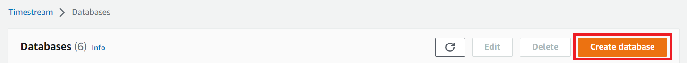
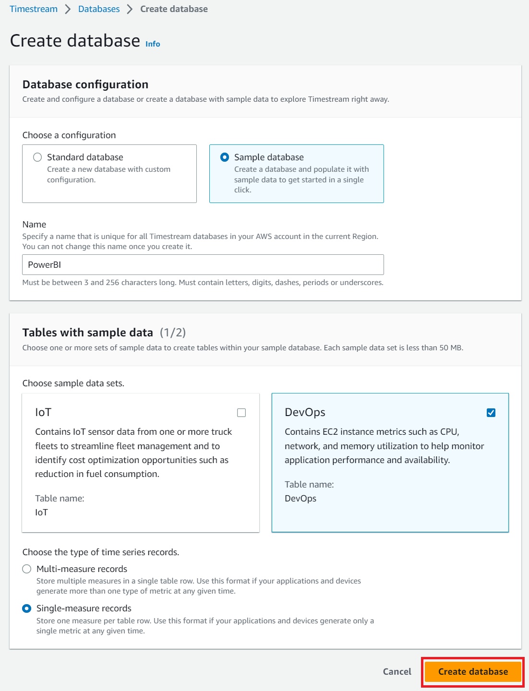
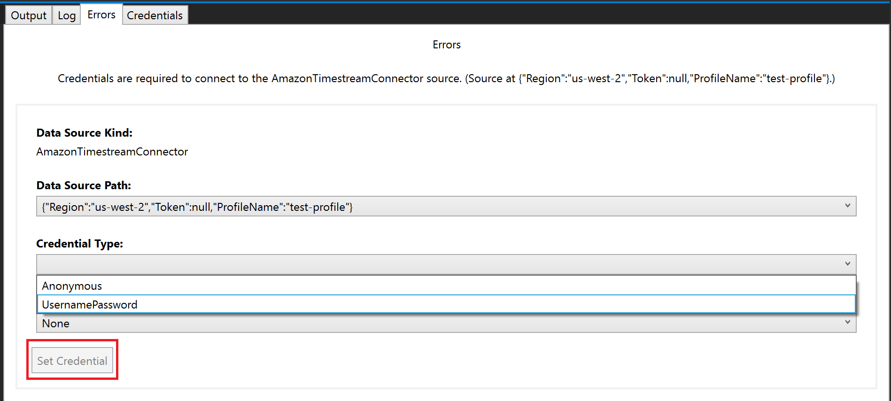

# Building the Amazon Trino Power BI Connector

The connector file `AmazonTrinoConnector.mez` is a ZIP archive containing the power query files.

The folder `src\PowerBIConnector\AmazonTrinoConnector` contains Power BI connector which supports `AWS Profile` and `AWS IAM Credentials` authentication, and the folder `src\PowerBIConnector\AmazonTrinoAADConnector` contains sample Azure AD connector which is not fully functional.

## Building the Connector
* Open PowerShell and run `.\AmazonTrinoConnector.ps1` from within the `src\PowerBIConnector` directory. Then the `AmazonTrinoConnector.mez` file will be created. 
* Copy `AmazonTrinoConnector.mez` to the `C:\Users\<User>\Documents\Power BI Desktop\Custom Connectors` directory (or to `<User>\OneDrive\Documents\Power BI Desktop\Custom Connectors` if using OneDrive), and create the directory if it is missing.
* To use the connector with the `On-premises data gateway`, copy `AmazonTrinoConnector.mez` to `C:\Windows\ServiceProfiles\PBIEgwService\Documents\Power BI Desktop\Custom Connectors`, and create the directory if it is missing.

## Prerequisites for Tests
1. Install Visual Studio 2019 as currently [Power Query SDK](https://marketplace.visualstudio.com/items?itemName=Dakahn.PowerQuerySDK) only has supports for up to Visual Studio 2019.
2. Install the [Power Query SDK](https://marketplace.visualstudio.com/items?itemName=Dakahn.PowerQuerySDK).
3. Prepare one of AWS IAM Credentials or AWS Profile credentials
4. An Amazon Trino sample database called `PowerBI` containing the `DevOps` table. To create the table, follow below steps
    1. Go to Trino → Databases
    
    2. Click **"Create database"** and you’ll see the below page. Select **"Sample database"** and enter "PowerBI" as database name. Then select **DevOps** sample table and select **Single-measure records**. The result page should look like below.
    
    3. Clicking on **"Create Database"** will create the desired data.
5. Have 32-bit Amazon Trino ODBC Driver installed. 

## Running the Tests
1. Load the `src\PowerBIConnector\AmazonTrinoConnector\AmazonTrinoConnector.mproj` file from the project directory.
    * Visual Studio may complain about the project not being able to load properly, right click on the solution and reload the project. This is related to tooling in the Power Query SDK.
2. Edit the `AmazonTrinoConnector.query.pq` file and set `Region` to the region where the `PowerBI` database is located.
    * If you are using `AWS Profile` authentication and not using `default`, enter the `Profile Name`.
    * If you are using `AWS IAM Credentials` authentication and multi-factor authentication, enter the `AWS IAM Session Token`.
3. Run the project by clicking **"Start"**.

    

    During the first time, you will be asked to enter your credential information. Select `Anonymous` for `AWS Profile` authentication, or `UsernamePassword` for `AWS IAM Credentials` authentication. 
    Then click `Set Credential`.

    

    **Note:** The tests are data dependent and while the sample databases created have the same schema, the dates and data values will be different. The tests for aggregate functions like sum and the minimum time, and mathmatical functions like sin and tangent may have to be updated.

4. After saving the credentials, run the project again to view the test results.

    

## Trouble-shoot
1. Error `The Amazon Trino ODBC driver is not installed.`

   Currently the connector tests only works with 32-bit Amazon Trino ODBC Driver. Ensure the 32-bit driver is installed.
