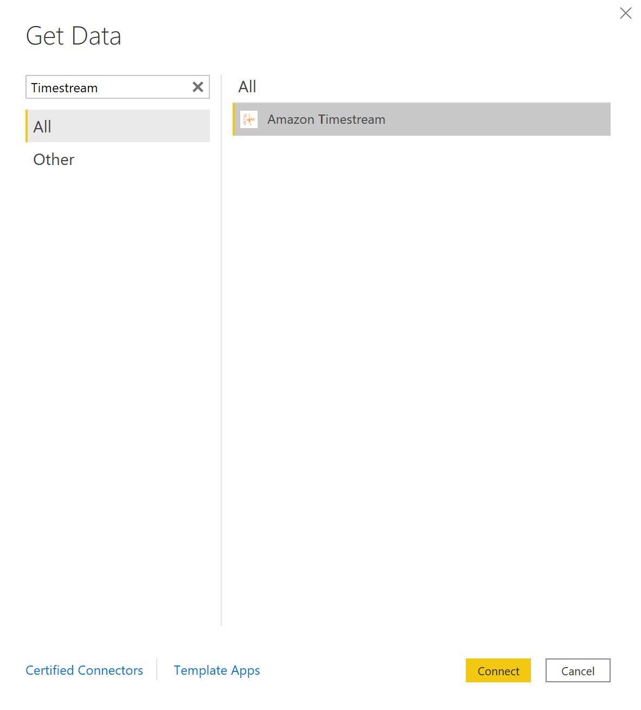
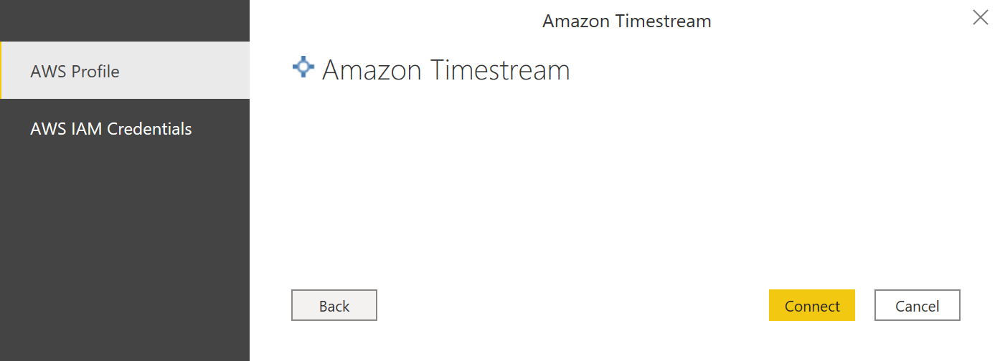
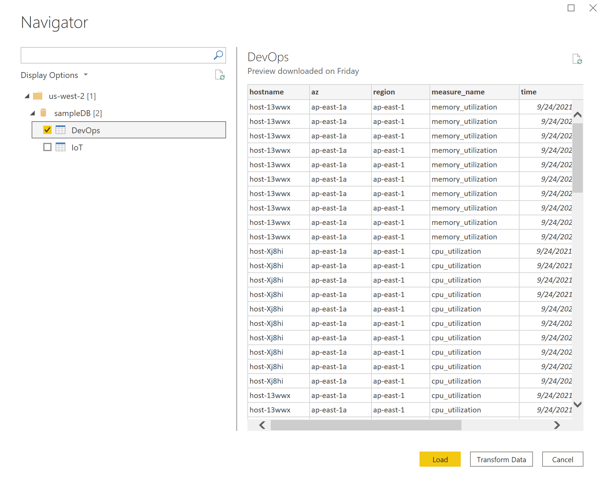
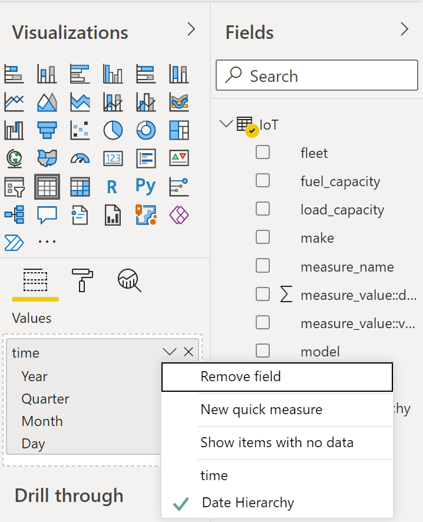

# Microsoft Power BI Desktop - Using Import Mode with the Amazon Trino Custom Connector

The custom connector only supports `AWS Profile` and `AWS IAM Credentials` authentication. Azure Active Directory and Okta authentication are not supported at this time.

Import mode loads all data and stores the information on disk. The data must be refreshed and reloaded in order to show data updates. [Custom Connector - Import Mode vs Direct Query Mode](https://social.technet.microsoft.com/wiki/contents/articles/53078.power-bi-import-mode-vs-directquery-mode.aspx)

## Prerequisites
Before you get started, make sure you've properly installed the Amazon Trino ODBC driver. 

Copy the `AmazonTrinoConnector.mez` file to the `C:\Users\<User>\Documents\Power BI Desktop\Custom Connectors\` folder (or to `<User>\OneDrive\Documents\Power BI Desktop\Custom Connectors` if using OneDrive). This will let Power BI access custom connector.

From Power BI Desktop, change the settings to allow Power BI to use custom connectors.
* Open Power BI Desktop.
* Change the security settings. Click on `Files` > `Options and settings` > `Options` > `Security` > Select `Allow any extension to load without validation or warning` for Data Extensions. This will allow the custom connector to load data into Power BI.

   

* Restart Power BI Desktop.

**Note:** The Amazon Trino custom connector only supports `AWS Profile` and `AWS IAM Credentials` authentication. Azure Active Directory and Okta authentication are not supported at this time.

## Connecting using the Amazon Trino custom connector

1. Select `Amazon Trino` from `Get Data` and click `Connect`. You may get a warning for using third-party service. Click on `Continue`.

   

2. Enter the region. To connect using `AWS Profile` authentication, optionally enter the `Profile Name`. To connect using `AWS IAM Credentials` authentication, optionally enter the `AWS IAM Session Token` for multi-factor authentication. Click `OK`.

   

   **Note:** If you are using a very large dataset, importing all of the data may take a long time.

3. If this is the first time connecting to this data source, select the authentication type and input your credentials when prompted. The authentication types available are:

    * AWS Profile: If not using the default profile, you should enter the `Profile Name` on the previous screen.
    * AWS IAM Credentials: If using multi-factor authentication, you may need to enter the `AWS IAM Session Token` on the previous screen.
    
   Once you are done, click `Connect`.

   

4. In the Navigator, select the database tables you want, then either select `Load` to load the data or `Transform Data` to continue transforming the data.

   

**Notes:**

* All date/time fields are rounded to the nearest second when imported.

* By default, dates are displayed as a date hierarchy (Year, Quarter, Month, Day). To change the display, under `Visualizations` click `v` next to the field and select `time` instead of `Date Hierarchy`.

   

* Your Data Source Settings are saved once you connect. To modify them, select **Transform Data** > **Data Source Settings**.
