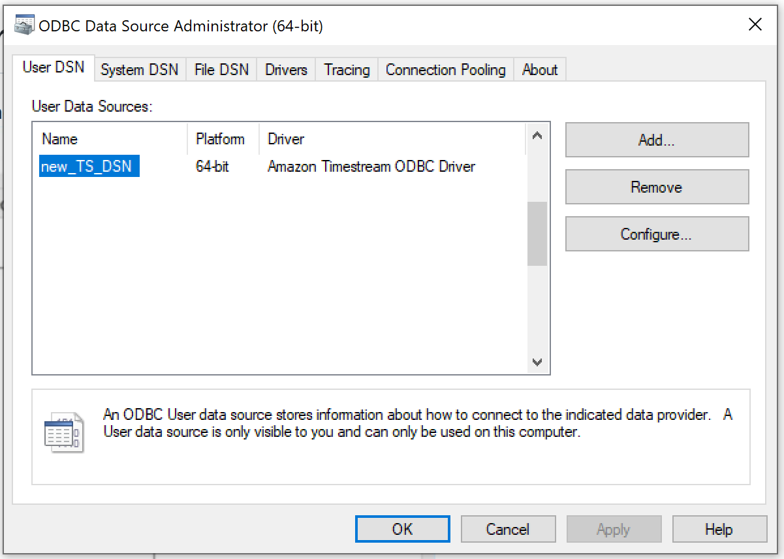
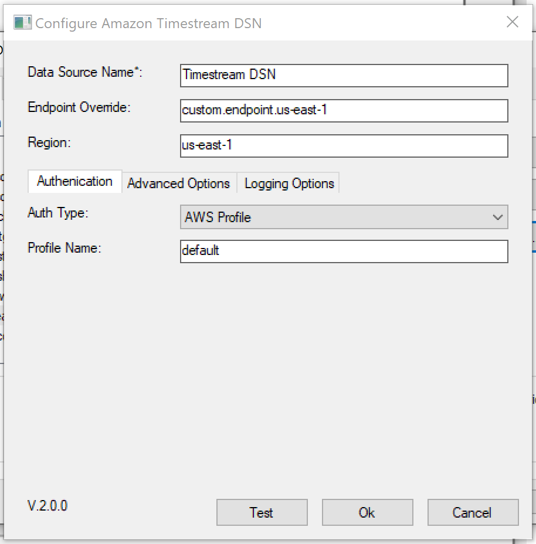
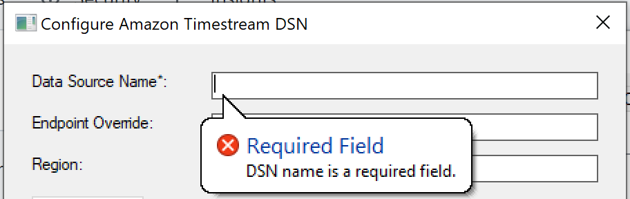

# Windows - Configuring a DSN

1. Open ODBC Driver Data Source Administrator (choose the proper bitness: 32 or 64)
    
2. Click `Add` to add a new DSN.
3. Choose Amazon Timestream ODBC Driver.
4. Fill the Windows Form properly. For information on how to fill the properties, see [Connection String Properties](connection-string.md). 
    
5. Click `Test` to verify connectivity; you will get a `Connection succeeded` message if your configuration is correct.
6. Click `OK` to save the DSN values. 

## Notes

- When `Identitiy Provider: Azure AD` or `Identitiy Provider: Okta` are in the `Auth Type` field, the access key ID, secret access key and session token fields will be hidden as they are not needed.

- Balloons would appear as tips when wrong input is entered for selected field. Clicking out of the field would cause the balloon to temporarily disappear. 

