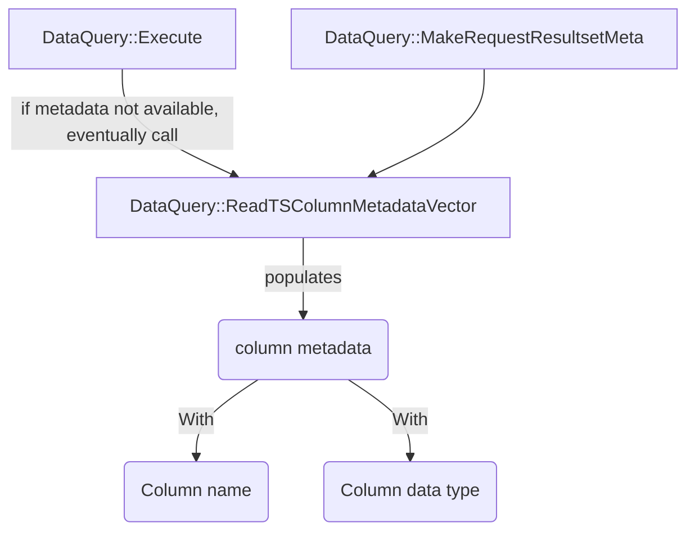
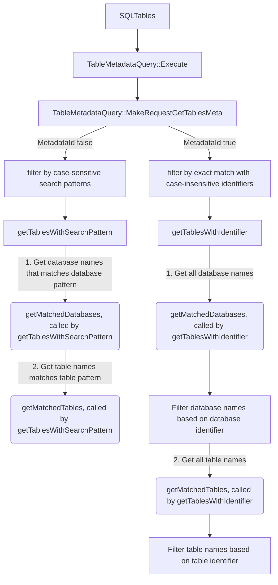

# Metadata Design

## How column metadata for query execution works
Below is a diagram of how column metadata (type ColumnMeta) is populated using DataQuery class functions.

## How table metadata works
Below is a diagram of how table metadata (type TableMeta) is populated using TableMetadataQuery class functions. 

`MetadataId` in the graph is referring to `SQL_ATTR_METADATA_ID`, a supported [connection attribute](odbc-support-and-limitations.md/#supported-connection-attributes) which affects [SQLTables](odbc-support-and-limitations.md/#sqltables). 

