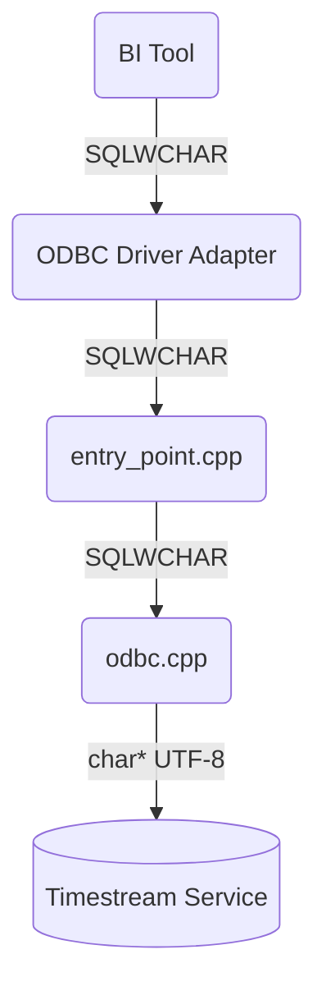

# 1. Unicode Support

The Timestream ODBC Driver supports the Unicode ODBC interface. It does not support the non-Unicode interface.

## 1.1. Unicode encoding at ODBC Layer

The definition of the Unicode at the ODBC layer is defined as SQLWCHAR. There are platform specific implementations.

- *Windows*: The SQLWCHAR is defined as wchar_t (2-byte)
- *MacOS (iODBC)*: The SQLWCHAR is defined as wchar_t (4-byte)
- *Linux (unixODBC)*: The SQLWCHAR is defined as unsigned short (2-byte)

In terms of our driver, the entry point is the entry_point.cpp/h. For each API entry point, it calls the equivalent in the `odbc` namespace.

Here we pass the SQLWCHAR pointer to/from entry_point and odbc. 

However, from the `odbc` namespace to the rest of the driver, we encode data in UTF-8 encoding. The reason being is that all the strings in Timestream use UTF-8 encoding. So to minimize the number of conversions, we choose to use UTF-8 encoding at this layer.

The environment variable `ANSI_STRING_ONLY` is used to indicate the data source has only ANSI characters by setting it to `TRUE`. As a result, characters will be copied from the data source to the user buffer directly without converting UTF8 to wstring and then do a mapping from unicode to ANSI characters. 

## 1.2. Logging

Log files are encoded in UTF-8 format with BOM (byte-order-mark).

## 1.3. Literals

When creating and comparing literals with the C/C++ data type of `[const] char*`, ensure to use the literal prefix: `u8`. For example : `u8"你好"`.

When creating use the `NewSqlWchar(L"你好")` function. When comparing literals in SQLWCHAR , first convert to string (`utility::SqlWcharToString()`) and then compare as UTF-8 literal `u8"你好"`.
